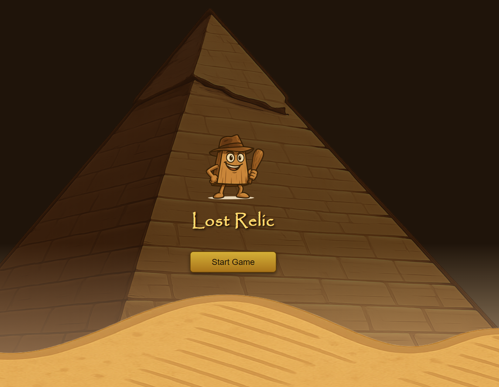

# Simple 3D Game (Three.js & Rapier3D)

Projekt gry 3D zrealizowany w JavaScript z użyciem **Three.js** do grafiki i **Rapier3D** do fizyki. Postacie korzystają z animacji FBX (gracz i przeciwnicy z animowanymi modelami). Sztuczna inteligencja wrogów obsługiwana jest przez Finite State Machine (FSM).

## Funkcje gry

- **Sterowanie graczem** (chodzenie, bieganie, skakanie, taniec)
- **Przeciwnicy** (AI) patrolują teren, wykrywają gracza i ścigają go
- **Animacje FBX** — przełączanie stanów animacji dla postaci
- **Fizyka** oparta na Rapier3D (kolizje, grawitacja)
- **Patrol i ściganie** — AI wybiera cele na podstawie dystansu do gracza

## Demo


*(np.  )*

## Instalacja

1. **Sklonuj repozytorium:**
    ```bash
    git clone https://github.com/Twiggiermaen21/SimpleGame.git
    cd SimpleGame
    ```

2. **Zainstaluj zależności:**
    ```bash
    npm install
    ```

3. **Uruchom projekt:**
    ```bash
    npm run dev
    ```
    *(lub inny odpowiedni skrypt, zależnie od użytego bundlera)*

4. **Wejdź na:**
    ```
    http://localhost:3000
    ```


## Najważniejsze pliki

- entity/enemy/ – AI przeciwników, FSM, modele wroga
- entity/player/ – kod gracza, FSM, modele i animacje gracza
- engine/ – silnik gry: kamera, światło, fizyka, grafika
- public/glb/ – pliki modeli świata (GLB)
- tool/ – narzędzia, np. do ładowania modeli

## Wymagania

- Node.js
- Przeglądarka obsługująca WebGL

## Zależności

- [three.js](https://threejs.org/)
- [@dimforge/rapier3d-compat](https://www.npmjs.com/package/@dimforge/rapier3d-compat)
- [three/examples/jsm/loaders/FBXLoader.js](https://threejs.org/docs/#examples/en/loaders/FBXLoader)

## TODO

- Dodanie obsługi dźwięku
- Lepsza detekcja kolizji
- Wrogowie z różnymi zachowaniami
- Tryb multiplayer

## Licencja

MIT

---

**Autor:**  
[Twój nick lub imię](https://github.com/Twiggiermaen21)


